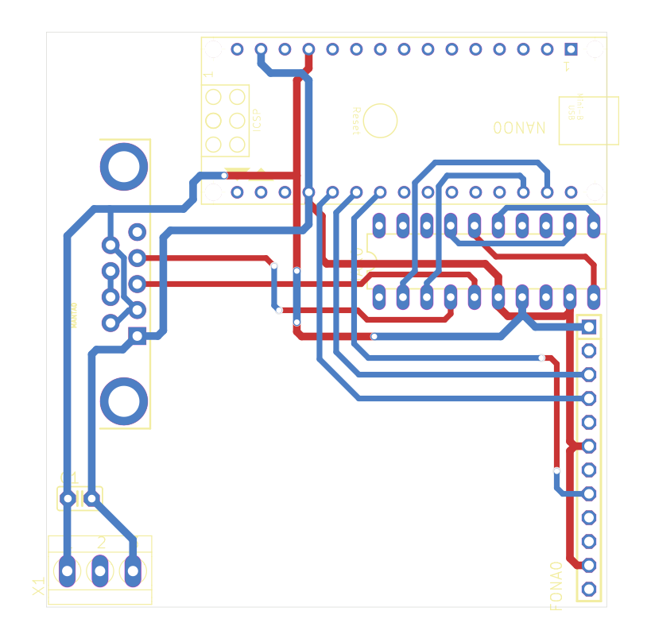

# Water Quality Sensor Interface Board — Circuit

Design files for a board that reads a water quality sensor and uploads its readings over the cellular network. Designed in **Eagle 7.6**, laid out April 2018.

The sensor speaks **RS-232**, which a microcontroller cannot read directly. An **Arduino Nano** sits behind a **MAX233** transceiver that converts the sensor's incoming RS-232 signals down to TTL serial the Nano can read. The Nano then pushes the data to a remote server over cellular using a **SIM800** module with an ordinary SIM and data plan.

It is essentially a protocol-and-transport bridge: a legacy serial instrument on one end, a cellular uplink on the other, and level translation in between.

**Server:** [watermon](https://github.com/irpl/watermon) — the listener this board uploads to.

*Two-layer copper layout — red is the top layer, blue the bottom.*

## Design files

[`eagle/`](eagle/) contains the Eagle schematic (`.sch`) and board (`.brd`).

## Design notes

- **MAX233** rather than the more common MAX232: it integrates the charge-pump capacitors, so the level shifter needs no external capacitors — fewer parts to place, fewer things to fail in the field.
- **DB9 connector** on the board edge, so the sensor plugs straight in with a standard serial cable.
- Footprints for the **Arduino Nano** and the Adafruit **SIM800** cellular module, plus a 2×3 ICSP header.
- Screw terminal for field power.

The Eagle files carry no component values (only the terminal block is valued), so no BOM can be generated from them directly.
